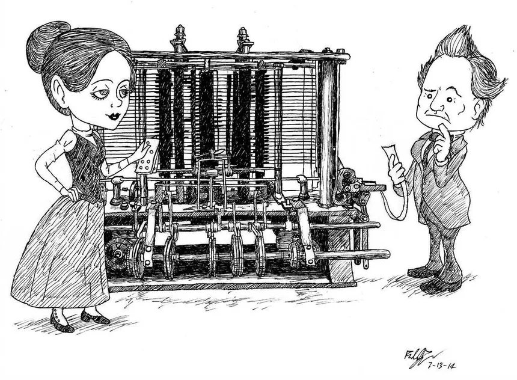

# Introducción a la programación web 01

## Introduccion personal

- Docente
- Alumnos

## Planificacion del curso

- Entrega de la planificacion
- Discusion sobre la misma

## Inicio

### Hardware y Software

### Software

Que es el software?

Es el conjunto de componentes no tangibles, los programas o aplicaciones que encontramos en los ordenadores.

### Hardware

Que es el Hardware?

Es el conjunto de componentes fisicos o tangibles de los ordenadores.

<small>X10DRi For Two-way Server E-ATX Motherboard LGA 2011 Support C612 E5-2600 v3/v4 Family DDR4</small>

O tambien...

### La Programacion

Que es programar?.

Es el proceso de diseñar y escribir instrucciones que una computadora puede ejecutar. Estas instrucciones, conocidas como código, le dicen a la computadora cómo realizar tareas específicas.

Los ordenadores son calculadoras muy muy potentes pero muy muy tontas, tenemos que describir exactamente todo lo que deben hacer.

Historia de la Programación.

#### **Máquina Analítica de Charles Babbage (1837)**

**Charles Babbage** diseñó la Máquina Analítica, considerada como el precursor de la computadora moderna. Aunque nunca fue construida en su totalidad, su diseño incluía elementos esenciales de una computadora, como una unidad de control, una memoria y la capacidad de realizar cálculos matemáticos.

**Ada Lovelace**, trabajando con Babbage, escribió un **algoritmo** para la Máquina Analítica para calcular los números de Bernoulli, lo que la convierte en la primera programadora de la historia.

#### **Tarjetas Perforadas de Herman Hollerith (1890)**

  | **Tabuladora** (1890) |  <!-- -->  |
  |---|---|
  | Desarrolló un sistema de tarjetas perforadas para procesar datos del censo de 1890 en Estados Unidos. Este sistema permitió una manipulación y almacenamiento de datos más eficientes y es un precursor de los métodos de entrada de datos en computadoras tempranas. |  |

#### **Computadoras de la Segunda Guerra Mundial**

Durante la Segunda Guerra Mundial, se desarrollaron varias computadoras para fines militares. Notablemente:

  | **Colossus** (1943) |  <!-- -->  |
  |---|---|
  | Utilizada por los británicos para descifrar códigos alemanes. | 
  
 |

  | **ENIAC** (1945) | ENIAC_on_a_Chip |
  |---|---|
  | La primera computadora electrónica de propósito general, desarrollada por **John Presper Eckert** y **John Mauchly** | University of Pennsylvania (1995) - Computer History Museum |
  |  | _-_Computer_History_Museum.webp) |

#### **Lenguaje de Programación Assembly (1940s)**

- Los primeros programas se escribieron en lenguaje máquina, pero pronto surgieron los lenguajes de ensamblador (assembly) para simplificar el proceso. Estos lenguajes permitían a los programadores escribir instrucciones en un formato más legible y fácil de entender.

#### **Primeros Lenguajes de Programación de Alto Nivel**

- **FORTRAN (1957)**: Desarrollado por **John Backus** y su equipo en IBM, FORTRAN (FORmula TRANslation) fue el primer lenguaje de programación de alto nivel y se utilizó principalmente para cálculos científicos y de ingeniería.
- **COBOL (1959)**: Diseñado por **Grace Hopper** y otros, COBOL (COmmon Business-Oriented Language) se convirtió en el lenguaje estándar para aplicaciones de negocios y finanzas.
- **LISP (1958)**: Creado por **John McCarthy**, LISP (LISt Processing) es uno de los primeros lenguajes de programación utilizados para la inteligencia artificial.

#### **Avances en la Programación Estructurada (1960s y 1970s)**

- **ALGOL (1960)**: Influenció muchos lenguajes de programación modernos y estableció conceptos importantes como la estructura de bloques.
- **C (1972)**: Desarrollado por **Dennis Ritchie** en los Laboratorios Bell, el lenguaje C introdujo una combinación de poder y flexibilidad, convirtiéndose en uno de los lenguajes de programación más influyentes.

#### **Paradigmas de Programación y Lenguajes Modernos**

- **Programación Orientada a Objetos (OOP)**: El lenguaje **Smalltalk** (1970s) y más tarde **C++** (1983) y **Java** (1995) popularizaron la OOP, que organiza el software en objetos que encapsulan datos y comportamientos.
- **Python (1991)**: Creado por **Guido van Rossum**, Python se destaca por su sintaxis clara y su facilidad de uso, y ha ganado popularidad en diversos campos, incluyendo el desarrollo web y la ciencia de datos.
- **JavaScript (1995)**: Desarrollado por **Brendan Eich**, se convirtió en el lenguaje dominante para la programación web del lado del cliente.

### Clasificacion de los lenguajes de programación

Por Nivel de Abstracción

- **Bajo Nivel**: Cercanos al lenguaje máquina y al hardware, proporcionan poco o ningún nivel de abstracción sobre el hardware. **Ej**: Lenguaje ensamblador (Assembly).
- **Alto Nivel**: Más cercanos al lenguaje humano, proporcionan un alto nivel de abstracción y son independientes del hardware específico. **Ej**: Python, Java, C++.

Por Paradigma de Programación

- **Imperativos**: Basados en la ejecución de instrucciones secuenciales que cambian el estado del programa. **Ej**: C, Pascal.
- **Orientados a Objetos**: Basados en el concepto de "objetos", que encapsulan datos y comportamientos. **Ej**: Java, C++, Python.
- **Funcionales**: Basados en el concepto de funciones matemáticas, evitan el uso de estados y datos mutables. **Ej**: Haskell, Lisp.
- **Lógicos**: Basados en la lógica formal y el razonamiento lógico. **Ej**: Prolog.
- **Concurrentes**: Enfocados en la ejecución simultánea de procesos o hilos. **Ej**: Erlang, Go.

Por Uso y Aplicación

- **Propósito General**: Diseñados para una amplia variedad de aplicaciones. **Ej**: Python, Java, C++.
- **Dominio Específico**: Diseñados para tareas específicas. **Ej**: SQL (bases de datos), HTML (marcado web), MATLAB (computación numérica).

Por Paradigma de Ejecución

- **Compilados**: Los programas son traducidos a código máquina antes de ser ejecutados. **Ej**: C, C++.
- **Interpretados**: Los programas son ejecutados directamente por un intérprete sin una compilación previa. **Ej**: Python, Ruby.
- **Mixtos**: Utilizan tanto compilación como interpretación. **Ej**: Java (compilado a bytecode y luego interpretado por la JVM).

Por Paradigma de Tipos de Datos

- **Tipado Estático**: Los tipos de datos de todas las variables se conocen y se verifican en tiempo de compilación. **Ej**: Java, C, C++.
- **Tipado Dinámico**: Los tipos de datos se determinan en tiempo de ejecución. **Ej**: Python, JavaScript.

### La Web

Década de 1990: Nacimiento de la World Wide Web

- 1989-1991: Tim Berners-Lee, científico británico en el CERN, desarrolla la World Wide Web (WWW) como una manera de compartir información científica de manera más eficiente.
- 1991: La primera página web es creada por Tim Berners-Lee, consistiendo en texto estático con enlaces a otros documentos.
- 1993: Marc Andreessen y Eric Bina crean Mosaic, el primer navegador web gráfico, que permite a los usuarios ver imágenes junto con el texto.
- 1994: Netscape Communications Corporation lanza Netscape Navigator, que se convierte en uno de los navegadores web más populares de la época.
- 1995: **Brendan Eich** crea **JavaScript** en **Netscape Navigator**, introduciendo la capacidad de agregar interactividad y dinamismo a las páginas web.
- 1995: Java es lanzado por Sun Microsystems, permitiendo el desarrollo de applets Java para enriquecer las páginas web.
- 1996: CSS (Cascading Style Sheets) es introducido para controlar la presentación y el diseño de las páginas web.

Finales de la década de 1990: Explosión del Comercio Electrónico y las Aplicaciones Web

- 1998: Google es fundado por Larry Page y Sergey Brin, revolucionando la búsqueda en línea y la forma en que se organizan los datos en la web.
- 1999: La especificación XML (eXtensible Markup Language) es publicada, permitiendo la creación de datos estructurados para la web.

Década de 2000: Web 2.0 y Avances en Tecnologías Web

- 2004: Mark Zuckerberg lanza Facebook, que se convierte en una de las plataformas de redes sociales más grandes y populares del mundo.
- 2004: Google lanza Gmail, un servicio de correo electrónico basado en la web que introduce la idea de una interfaz de usuario rica y dinámica en la web.
- 2006: Twitter es lanzado, popularizando el microblogging y la transmisión de mensajes cortos en línea.
- 2006: Amazon lanza Amazon Web Services (AWS), introduciendo la idea de la computación en la nube y cambiando radicalmente la forma en que se desarrollan y entregan las aplicaciones web.
- 2008: HTML5 es anunciado, introduciendo nuevas características como el soporte para audio y video nativos, gráficos vectoriales y mejoras en la semántica y accesibilidad.

Década de 2010 hasta la Actualidad: Continua Evolución y Sofisticación

- 2010 en adelante: Auge de los marcos de trabajo (frameworks) y bibliotecas de JavaScript como AngularJS, React.js y Vue.js, que simplifican el desarrollo de aplicaciones web complejas y dinámicas.
- 2015: Lanzamiento de GraphQL, un lenguaje de consulta para APIs, que proporciona una forma más eficiente y flexible de solicitar y entregar datos en aplicaciones web.
- 2015: Lanzamiento de Progressive Web Apps (PWAs), que ofrecen una experiencia similar a la de las aplicaciones nativas en la web, incluyendo capacidades como el acceso fuera de línea y notificaciones push.
- 2020 en adelante: Continua innovación en tecnologías web, incluyendo WebAssembly para ejecutar código de alto rendimiento en el navegador, WebRTC para comunicaciones en tiempo real, y la adopción de estándares como HTTP/2 y HTTP/3 para mejorar el rendimiento y la seguridad.

