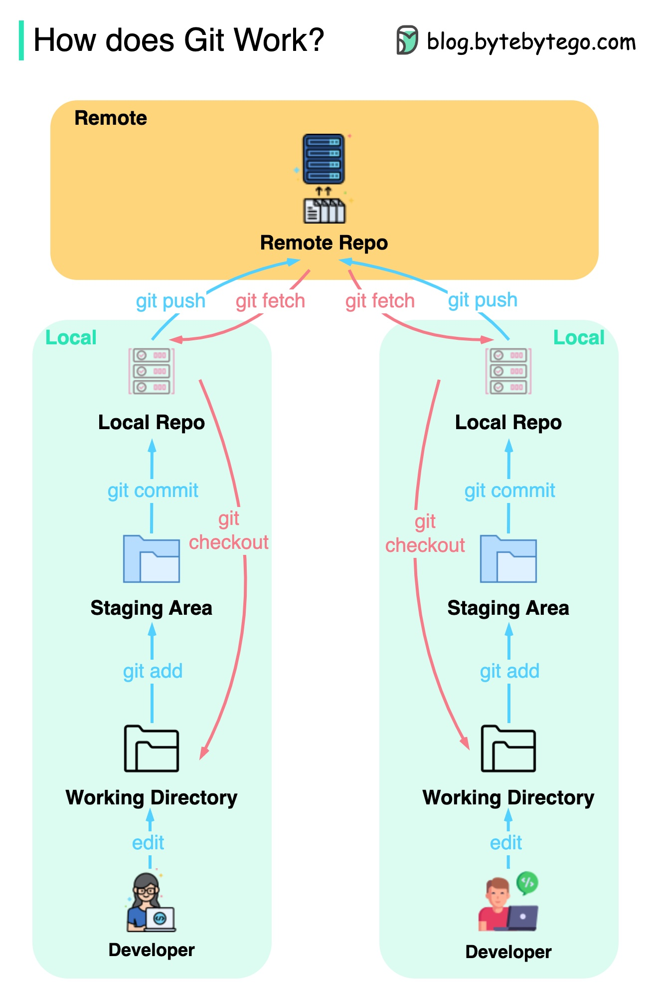
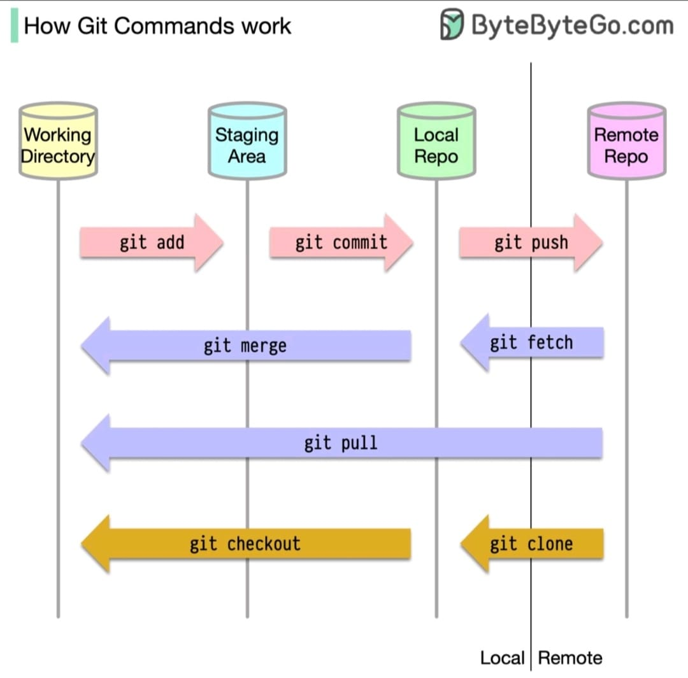

# Git y Github 01

## Introducción a Git

    Git es un sistema de control de versiones distribuido, utilizado principalmente para el desarrollo de software. Permite a los desarrolladores colaborar en proyectos, realizar un seguimiento de los cambios en el código fuente a lo largo del tiempo y gestionar múltiples versiones del proyecto de manera eficiente.

</img>
<!--  -->

## Configuracion inicial

Para empezar acumular commits y hacer push a repositorios debemos asignar el `name` e `email` del autor

```bash
git config --global user.name "Tu Nombre"
git config --global user.email "<tuemail@ejemplo.com>"
```

## Comandos básicos: init, status, add, commit, push y pull

- [init](https://git-scm.com/docs/git-init)
- [status](https://git-scm.com/docs/git-status)
- [add](https://git-scm.com/docs/git-add)
- [commit](https://git-scm.com/docs/git-commit)
- [push](https://git-scm.com/docs/git-push)
- [pull](https://git-scm.com/docs/git-pull)

</img>
<!--  -->

### `git init`

Este comando inicializa un nuevo repositorio de Git en el directorio actual. Crea un subdirectorio oculto .git que contiene todos los archivos necesarios del repositorio, como el historial de versiones y la configuración del repositorio.

- Uso tipico:

```bash
git init
```

### `git status`

Este comando es esencial para entender el estado actual de tu repositorio y los archivos en tu directorio de trabajo.
Te permite ver qué cambios se han hecho, cuáles están preparados para el próximo commit y cuáles aún no.
Utilizar git status regularmente te ayudará a mantenerte al tanto de tus cambios y a gestionar tu flujo de trabajo de manera más eficiente.

- Uso tipico:

```bash
git status
```

### `git add`

Este comando añade cambios en el directorio de trabajo al área de preparación (staging area). Git no realiza automáticamente un seguimiento de los cambios en los archivos; primero necesitas añadirlos a la zona de preparación para que estén listos para ser confirmados en el historial del repositorio.

- Para añadir el archivo modificado:

```bash
git add [archivo]
```

- Para añadir todos los archivos modificados:

```bash
git add .
```

### `git commit`

Este comando confirma los cambios añadidos al área de preparación y los guarda en el historial del repositorio con un mensaje descriptivo. Un commit es una instantánea de los cambios en ese momento.

- Uso:

```bash
git commit -m "Mensaje del commit"
```

- Para añadir y confirmar cambios en un solo paso:

```bash
git commit -am "Mensaje del commit"
```

### `git push`

Este comando envía los commits locales al repositorio remoto. Es especialmente útil para compartir cambios con otros colaboradores. Requiere que hayas configurado un repositorio remoto.

- Uso tipico:

```bash
git push [nombre-remoto] [nombre-rama]
```

- Por defecto, el nombre del remoto suele ser origin y la rama principal main o master:

```bash
git push origin main
```

### `git pull`

Este comando actualiza la rama actual con los cambios del repositorio remoto. Combina `git fetch` y `git merge`, primero descarga los cambios del remoto y luego los fusiona con tu rama local.

- Uso tipico:

```bash
git pull [nombre-remoto] [nombre-rama]
```

- Por defecto, el nombre del remoto suele ser origin y la rama principal main o master:

```bash
git pull origin main
```

## Flujos tipicos

Vamos a simular escenarios comunes en los que pueden surgir al trabajar con Git:

- Creacion de repositorio y primera subida
- Conflictos comunes al hacer `push` o `pull`

### Creacion de repositorio y primera subida

1. Inicializar un repositorio:

```bash
git init
```

2. Añadir cambios al área de preparación:

```bash
git add archivo.txt
```

3. Confirmar los cambios:

```bash
git commit -am "Agregar archivo.txt"
```

4. Enviar los cambios al repositorio remoto:

```bash
git push origin main
```

5. Actualizar la rama local con los cambios del remoto:

```bash
git pull origin main
```

### Conflictos comunes al hacer `push` o `pull`

Vamos a simular dos escenarios comunes en los que pueden surgir conflictos al trabajar con Git:

- Hacer push y fallar debido a commits nuevos en el repositorio remoto.
- Hacer pull y fallar debido a commits nuevos en el espacio de trabajo local.

Para ambos casos, asumiremos que ya tienes un repositorio configurado y has hecho algunos cambios en tu rama local.

#### Conflicto al hacer push

Escenario 1: Hacer push y fallar debido a commits nuevos en el repositorio remoto

1. Realizar cambios y confirmar en la rama local

```bash
echo "console.log('Cambios locales')" > main.js
git add main.js
git commit -m "Cambios locales"
```

2. Intentar hacer push y fallar

```bash
git push origin main
```

Suponiendo que hay nuevos commits en el repositorio remoto que no tienes en tu repositorio local, el push fallará y Git mostrará un mensaje como:

```bash
To <https://github.com/usuario/repositorio.git>
 ! [rejected]        main -> main (fetch first)
error: failed to push some refs to '<https://github.com/usuario/repositorio.git>'
hint: Updates were rejected because the remote contains work that you do
hint: not have locally. This is usually caused by another repository pushing
hint: to the same ref. You may want to first integrate the remote changes
hint: (e.g., 'git pull ...') before pushing again.
hint: See the 'Note about fast-forwards' in 'git push --help' for details.
```

3. Solucionar el conflicto haciendo pull

Primero, hay que integrar los cambios del remoto a tu repositorio local:

```bash
git pull origin main
```

Si hay conflictos, Git mostrará un mensaje indicando los archivos en conflicto. Por ejemplo:

```bash
Auto-merging main.js
CONFLICT (content): Merge conflict in main.js
Automatic merge failed; fix conflicts and then commit the result.
```

4. Resolver el conflicto

Abre el archivo en conflicto (main.js) y resuelve el conflicto manualmente. El contenido del archivo se verá algo así:

```diff
<<<<<<< HEAD
console.log('Cambios locales')
=======

console.log('Cambios remotos')
>>>>>>> origin/main
```

Edita el archivo para resolver el conflicto:

```bash
console.log('Cambios locales y remotos combinados')
```

5. Añadir y confirmar los cambios resueltos

```bash
git add main.js
git commit -m "Resolver conflictos de merge"
```

6. Hacer push nuevamente

```bash
git push origin main
```

#### Conflicto al hacer pull

Escenario 2: Hacer pull y fallar debido a commits nuevos en el espacio de trabajo local

1. Realizar cambios locales sin confirmar

```bash
echo "console.log('Cambios locales no confirmados')" >> main.js
```

2. Intentar hacer pull y fallar

```bash
git pull origin main
```

Git puede mostrar un mensaje indicando que tienes cambios locales no confirmados:

```bash
error: Your local changes to the following files would be overwritten by merge:
main.js
Please commit your changes or stash them before you merge.
Aborting
```

3. Guardar temporalmente los cambios locales con stash

Si no quieres confirmar los cambios locales aún, puedes guardarlos temporalmente usando `git stash`:

```bash
git stash
```

<small>Documentacion a comando <a href="https://git-scm.com/docs/git-stash">stash</a></small>

4. Hacer pull nuevamente

Ahora puedes realizar el pull:

```bash
git pull origin main
```

5. Aplicar los cambios guardados
Recupera los cambios guardados con stash:

```bash
git stash pop
```

6. Resolver cualquier conflicto

Si hay conflictos después de aplicar el stash, resuélvelos manualmente de manera similar al primer escenario. Por ejemplo, si main.js tiene conflictos:

```diff
<<<<<<< HEAD
console.log('Cambios remotos')
=======

console.log('Cambios locales no confirmados')
>>>>>>> stash
```

Resuelve el conflicto editando el archivo:

```bash
console.log('Cambios locales y remotos combinados')
```

7. Añadir y confirmar los cambios resueltos

```bash
git add main.js
git commit -m "Resolver conflictos después del stash"
```

## Documentacion

[Official Docs](https://www.git-scm.com/doc)
