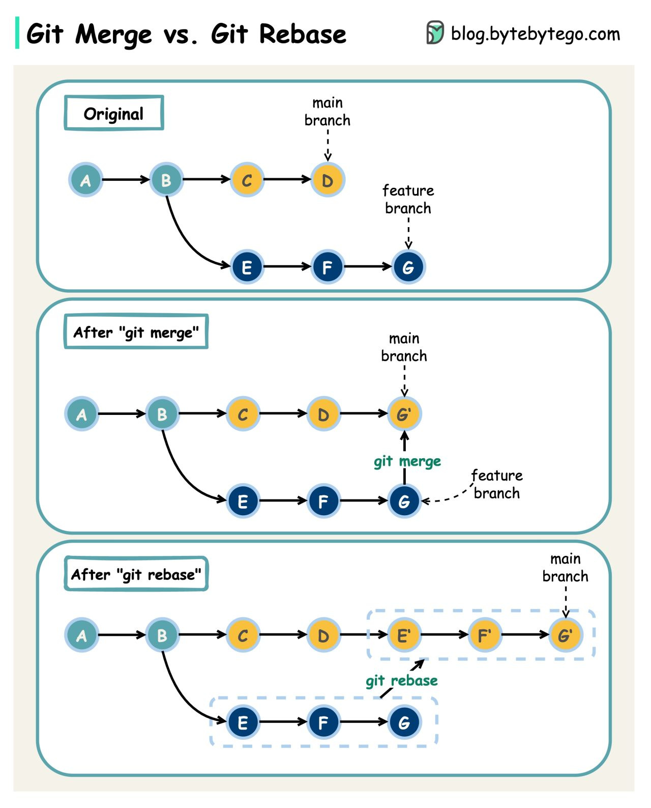

# Git y Github 02

## Continuacion Git

- Comprender y utilizar los comandos `branch`, `checkout`, `merge` y `fetch` en Git.
- Entender y aplicar la convención de Gitflow en el flujo de trabajo.

### Comandos `branch`, `checkout`, `merge` y `fetch` en Git

- [branch](https://git-scm.com/docs/git-branch)
- [checkout](https://git-scm.com/docs/git-checkout)
- [merge](https://git-scm.com/docs/git-merge)
- [fetch](https://git-scm.com/docs/git-fetch)

</img>
<!--  -->

#### git branch

- Crear y gestionar ramas es fundamental para entender cómo se organizan las diferentes versiones del proyecto.
- La creación de ramas es el primer paso para trabajar con varias líneas de desarrollo paralelas.

**Usos**:

- Crear una nueva rama: `git branch nombre_de_la_rama`
- Listar las ramas existentes: `git branch`
- Eliminar una rama: `git branch -d nombre_de_la_rama`

**Ejemplo**:

```bash
git branch feature/nueva-caracteristica
git branch
```

#### git checkout

- Cambiar entre ramas es el siguiente paso lógico después de crear ramas.
- `checkout` también se utiliza para crear nuevas ramas y restaurar archivos a su estado anterior.

**Usos**:

- Cambiar a una rama existente: `git checkout nombre_de_la_rama`
- Crear y cambiar a una nueva rama: `git checkout -b nombre_de_la_rama`
- Restaurar un archivo modificado: `git checkout -- nombre_del_archivo`

**Ejemplo**:

```bash
git checkout feature/nueva-caracteristica
git checkout -b feature/otra-caracteristica
```

#### git merge

Una vez que sabes cómo crear y cambiar entre ramas, necesitas aprender a combinar esas ramas.
La fusión es crucial para integrar el trabajo realizado en diferentes ramas.

**Usos**:

- Fusionar una rama en la rama actual: `git merge nombre_de_la_rama`
- Resolver conflictos de fusión.

**Ejemplo**:

```bash
git checkout develop
git merge feature/nueva-caracteristica
```

#### git fetch

- `fetch` se utiliza para obtener cambios del repositorio remoto sin fusionarlos automáticamente, lo cual es útil una vez que comprendes cómo trabajar con ramas y fusionarlas.
- Es importante para mantener tu repositorio local actualizado con los cambios del equipo.

**Usos**:

- Obtener cambios del repositorio remoto: `git fetch origin`
- Verificar los cambios obtenidos: `git log origin/main`

**Ejemplo**:

```bash
git fetch origin
git log origin/main
```

### Convención de Gitflow

1. Introducción a Gitflow

- ¿Qué es Gitflow?
- Beneficios de usar Gitflow en el desarrollo de software.

2. Ramas Principales en Gitflow

- `main` (o `master`): La rama principal que contiene el código de producción.
- `develop`: La rama principal para el desarrollo y la integración de nuevas características.

3. Ramas de Soporte en Gitflow

- Feature Branches

  - Usadas para desarrollar nuevas características.
  - Ejemplo de nombre: `feature/nueva-caracteristica`.
  - Flujo: crear desde `develop` y fusionar de nuevo en `develop`.

- Release Branches

  - Usadas para preparar una nueva versión para producción.
  - Ejemplo de nombre: `release/1.0.0`.
  - Flujo: crear desde `develop` y fusionar en main y `develop`.

- Hotfix Branches

  - Usadas para aplicar correcciones rápidas a la versión en producción.
  - Ejemplo de nombre: `hotfix/arreglar-bug`.
  - Flujo: crear desde `main` y fusionar en `main` y `develop`.

## Introducción a GitHub

1. ¿Qué es GitHub?

    - Explicación básica de GitHub como una plataforma de alojamiento de código que utiliza Git.
    - Ventajas de usar GitHub (colaboración, integración con otras herramientas, etc.).

2. Creación de una cuenta en GitHub

    - Cómo registrarse en GitHub.
    - Configuración básica del perfil.

### Interfaz de GitHub

1. Exploración del dashboard

    - Visión general del panel de control de GitHub.

2. Repositorios en GitHub

    - Crear un nuevo repositorio desde la interfaz web.
    - Navegar por un repositorio (archivos, commits, ramas, issues, pull requests).

### Flujo de Trabajo Típico en GitHub

1. Creación y Clonación de Repositorios

    - Crear un repositorio nuevo en GitHub.
    - Clonar un repositorio a tu máquina local: `git clone [URL del repositorio]`.

2. Hacer Cambios y Enviar Commits

    - Realizar cambios en archivos y hacer commits en tu repositorio local.
    - Sincronizar cambios con GitHub: `git push origin [nombre de la rama]`.

3. Trabajar con Ramas

    - Crear una nueva rama para trabajar en una característica o corrección: git checkout -b `[nombre de la rama]`.
    - Hacer cambios y commits en la nueva rama.
    - Empujar la rama al repositorio remoto: `git push origin [nombre de la rama]`.

4. Pull Requests

    - ¿Qué es un pull request?
    - Crear un pull request desde la interfaz web de GitHub.
    - Revisar y discutir los cambios en el pull request.
    - Aceptar y fusionar un pull request.

5. Actualizar el Repositorio Local

    - Mantener tu rama local actualizada con la rama principal: `git pull origin main` (o master dependiendo del nombre de la rama principal).
    - Resolver posibles conflictos de fusión.

### Colaboración en GitHub

1. Fork y Pull

    - Fork de un repositorio para hacer contribuciones a proyectos de terceros.
    - Clonar el fork, hacer cambios, y enviar un pull request al repositorio original.

2. Issues y Proyectos

    - Crear y gestionar issues (problemas, tareas, ideas).
    - Uso de proyectos (tableros estilo Kanban) para la gestión de tareas.

## Documentacion

[Official Docs](https://docs.github.com/es)

[Get Started](https://docs.github.com/es/get-started/start-your-journey)
