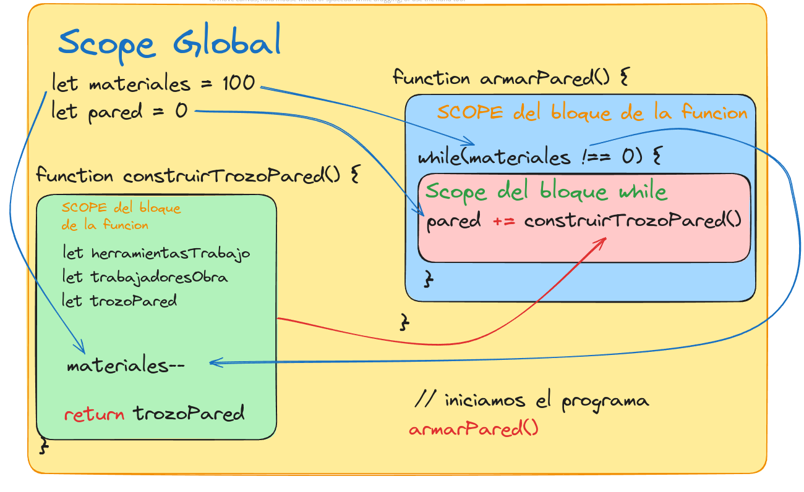

# Funciones en JavaScript y Contexto

- Contexto y `this`
- Funciones en JavaScript

## Contexto y `this`

- Scope
- Entorno léxico
- Contexto de ejecución
- Call Stack

### [Scope](https://excalidraw.com/#json=CxrJCR9F0Fzy4K0SXs3id,1dUNxrAkN7V58Lr2v8utBQ)

- El scope o ambito determina la accesibilidad de las variables y funciones en diferentes partes del código.

  En JavaScript, hay tres tipos principales de scope:

  

  - **Scope Global**: - Variables definidas fuera de cualquier función o bloque de código, accesibles desde cualquier parte del programa.

    ```javascript
    var globalVariable = 'Soy global';

    function mostrarGlobal() {
      console.log(globalVariable);
    }

    mostrarGlobal(); // Soy global
    ```

  - **Scope Local**: - Variables definidas dentro de una función, accesibles solo dentro de esa función.

    ```javascript
    function miFuncion() {
      var localVariable = 'Soy local';
      console.log(localVariable);
    }

    miFuncion(); // Soy local
    // console.log(localVariable); // Error: localVariable is not defined
    ```

  - **Scope de Bloque**: - Variables definidas dentro de un bloque ({}), accesibles solo dentro de ese bloque. Introducido con let y const en ES6.

    ```javascript
    if (true) {
      let blockVariable = 'Soy un bloque';
      console.log(blockVariable);
    }
    // console.log(blockVariable); // Error: blockVariable is not defined
    ```

### Entorno léxico

- El entorno léxico se refiere a la estructura de alcance de las variables en el momento en que se define una función.

  Un entorno léxico está compuesto por el ámbito local en el que se define una función y por el ámbito de sus funciones externas.

  ```javascript
  function externo() {
    var variableExterna = 'Soy de externo';

    function interno() {
      console.log(variableExterna);
    }

    interno();
  }

  externo(); // Soy de externo
  ```

  En este ejemplo, interno tiene acceso a variableExterna debido a su entorno léxico.

### Contexto de ejecución

- El contexto de ejecución en JavaScript es el entorno en el cual se ejecuta el código.

  Este contexto incluye información sobre variables, funciones, ámbito (scope) y el valor de la palabra clave this en un momento dado durante la ejecución del código.

#### Componentes del Contexto de Ejecución

- Scope Chain:

  - Una lista ordenada de objetos de ámbito (scope objects) que se busca para resolver referencias a variables durante la ejecución del código.

- Variable Object (Objeto de Variables):

  - Contiene todas las variables, funciones y parámetros formales definidos dentro del contexto de ejecución.

- Valor de `this`:
  - El valor de la palabra clave `this` en el contexto de ejecución actual.

```javascript
function primero() {
  console.log('Primero');
  segundo();
  console.log('Primero de nuevo');
}

function segundo() {
  console.log('Segundo');
  tercero();
}

function tercero() {
  console.log('Tercero');
}

primero();
```

#### Contexto y `this`

- El valor de `this` en una función depende de cómo se invoca la función:

  - Funciones en el Ámbito Global

    En el ámbito global, `this` se refiere al objeto global (en navegadores, `window`).

    ```javascript
    function mostrarThis() {
      console.log(this);
    }
    ```

  - Métodos de Objetos

    En métodos de objetos, `this` se refiere al objeto propietario del método.

    ```javascript
    const persona = {
      nombre: 'Juan',
      saludar() {
        console.log(`Hola, soy ${this.nombre}`);
      }
    };
    ```

  - Funciones Flecha y `this`

    Las funciones flecha no tienen su propio `this` heredan el `this` del contexto en el que fueron definidas.

    ```javascript
    const objeto = {
      nombre: 'Objeto',
      metodo: function () {
        const innerFunction = () => {
          console.log(this.nombre);
        };
        innerFunction();
      }
    };
    ```

### Call Stack

El Call Stack o "La pila de llamadas" es una estructura de datos que rastrea la ejecución de las funciones en JavaScript. Cada vez que se llama a una función, se agrega un marco (frame) a la pila de llamadas. Cuando la función termina su ejecución, el marco se elimina de la pila.

## Funciones en JavaScript

Son bloques de código diseñados para realizar una tarea particular.

En JavaScript, las funciones son ciudadanos de primera clase, lo que significa que pueden ser tratadas como cualquier otra variable: pueden ser asignadas a variables, pasadas como argumentos a otras funciones, y devueltas por otras funciones.

- Que son las funciones?
- Declaración de Funciones
- Parámetros y Argumentos
- Devolviendo datos: `return`
- Métodos de Funciones
- Funciones de Orden Superior
- Funciones Recursivas
- Ejercicios con funciones

### Que son las funciones?

- Definición:
  - Las funciones son bloques de código reutilizables que realizan una tarea específica.
- Importancia:
  - Ayudan a organizar el código, evitar la repetición y mejorar la legibilidad.

### Declaración de Funciones

- Funciones Declarativas
- Funciones Expresadas
- Funciones Flecha (Arrow Functions)

#### Funciones Declarativas

Se crean con la palabra reservada `function`, seguida del nombre de la función, una lista de parámetros entre paréntesis y el bloque de código entre llaves.

```javascript
// Bloque de declaracion de la funcion
function saludar(nombre) {
  return `Hola, ${nombre}`;
}

// Invocacion o llamada de la funcion
let name = 'Pablito';
saludar(name);
// "Hola, Pablito"
```

#### Funciones Expresadas

Se definen asignando una función a una variable. No tienen nombre propio (son funciones anónimas) y se invocan a través de la variable a la que están asignadas.

```javascript
// Bloque de declaracion de la funcion
const sumar = function (a, b) {
  return a + b;
};

// Invocacion o llamada de la funcion
let numero = 1;
sumar(10, numero);
// 11
```

#### Funciones Flecha (Arrow Functions)

Son una forma más concisa de escribir funciones anónimas. No tienen su propio contexto `this` y no pueden ser usadas como constructores.

```javascript
// Bloque de declaracion de la funcion
const restar = (a, b) => a - b;

// Invocacion o llamada de la funcion
let numero = 1;
restar(10, numero);
// 9
```

### Parámetros y Argumentos

- Parámetros por Defecto
- Objeto `arguments`

#### Parámetros por Defecto

Puedes asignar valores por defecto a los parámetros en caso de que no se pase ningún valor al invocar la función.

```javascript
// Declaracion de funcion `multiplicar` con el parametro `b` con valor por defecto
function multiplicar(a, b = 2) {
  return a * b;
}

console.log(multiplicar(5)); // Devuelve 10
```

#### Objeto `arguments`

Es una matriz similar a un objeto que contiene todos los argumentos pasados a una función, y segun sus caracteristicas:

- Está disponible dentro de todas las funciones y se puede utilizar para acceder a los argumentos pasados, independientemente de cuántos se esperen en la definición de la función.
- No es un array real, sino un "array similar a un objeto", por lo que no tiene métodos de array como `map` o `reduce`.
- Es útil para acceder a los argumentos en funciones donde el número de argumentos no es conocido de antemano o cuando se necesita compatibilidad con versiones anteriores de JavaScript.

```javascript
function sumarTodos() {
  let total = 0;
  for (let i = 0; i < arguments.length; i++) {
    total += arguments[i];
  }
  return total;
}

console.log(sumarTodos(1, 2, 3, 4)); // Devuelve 10
```

### Devolviendo datos: `return`

El uso de `return` en las funciones es fundamental para comprender como las funciones en JavaScript pueden producir resultados y comunicar valores de vuelta al codigo que invoco.

- Que es `return`
- Proposito de `return`

_Sintaxis_

```javascript
function nombreDefuncion() {
  // codigo de la funcion
  return valor;
}
```

#### Que es `return`

- Es una declaracion que finaliza la ejecucion de una funcion y especifica un valor que se devolvera a la funcion o expresion que la llamo.

#### Proposito de `return`

El `return` como expresion tiene 2 funciones

- Devolver un valor
- Terminar la ejecucion de la Funcion

### Métodos de Funciones

En javascript las funciones al ser tratadas tambien como objetos tienen metodos asociados.

- `call()`

  El método `call()` llama a una función con un valor de `this` y argumentos proporcionados individualmente.

  ```javascript
  function saludar() {
    console.log(`Hola, soy ${this.nombre}`);
  }

  const persona1 = { nombre: 'Ana' };
  saludar.call(persona1);
  ```

- `apply()`

  El método `apply()` llama a una función con un valor de `this` y argumentos proporcionados como un array.

  ```javascript
  const numeros = [5, 6, 2, 3];
  const maximo = Math.max.apply(null, numeros);
  ```

- `bind()`

  El método `bind()` crea una nueva función que, cuando se llama, tiene su valor de `this` fijado al valor especificado.

### Funciones de Orden Superior

Son aquellas que pueden aceptar otras funciones como argumentos y/o devolver funciones como resultados.

En esencia, tratan a las funciones como ciudadanos de primera clase.

Esto significa que puedes pasar una función como argumento a otra función, devolver una función desde otra función y asignar una función a una variable.

```javascript
// Ejemplo de funcion de orden superior
function operacionMatematica(func, a, b) {
  return func(a, b);
}

function suma(a, b) {
  return a + b;
}

function resta(a, b) {
  return a - b;
}

console.log(operacionMatematica(suma, 5, 3)); // Devuelve 8
console.log(operacionMatematica(resta, 5, 3)); // Devuelve 2
```

### Funciones Recursivas

Es aquella que se llama a sí misma dentro de su propia definición.

Esto se utiliza comúnmente para resolver problemas que pueden dividirse en subproblemas más pequeños del mismo tipo.

En JavaScript, es fundamental tener un caso base que detenga la recursión, de lo contrario, la función continuará llamándose a sí misma infinitamente, lo que puede provocar un desbordamiento de pila.

```javascript
// Ejemplo de funcion recursiva
function factorial(n) {
  if (n === 0) {
    return 1; // Caso base
  } else {
    return n * factorial(n - 1); // Llamada recursiva
  }
}

console.log(factorial(5)); // Devuelve 120 (5 * 4 * 3 * 2 * 1)
```

### Ejercicios con funciones
